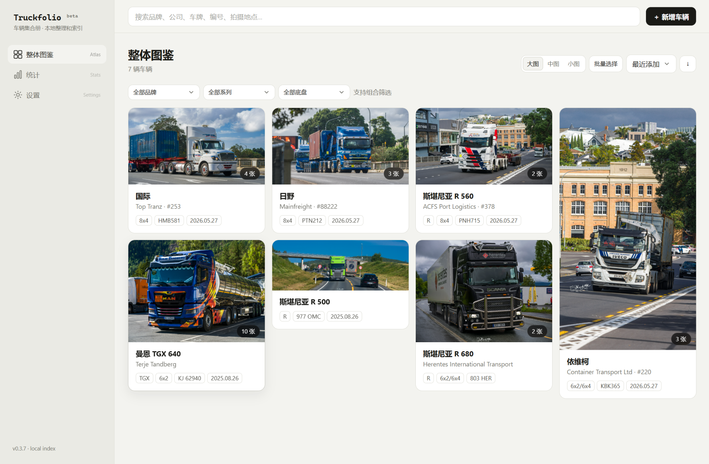
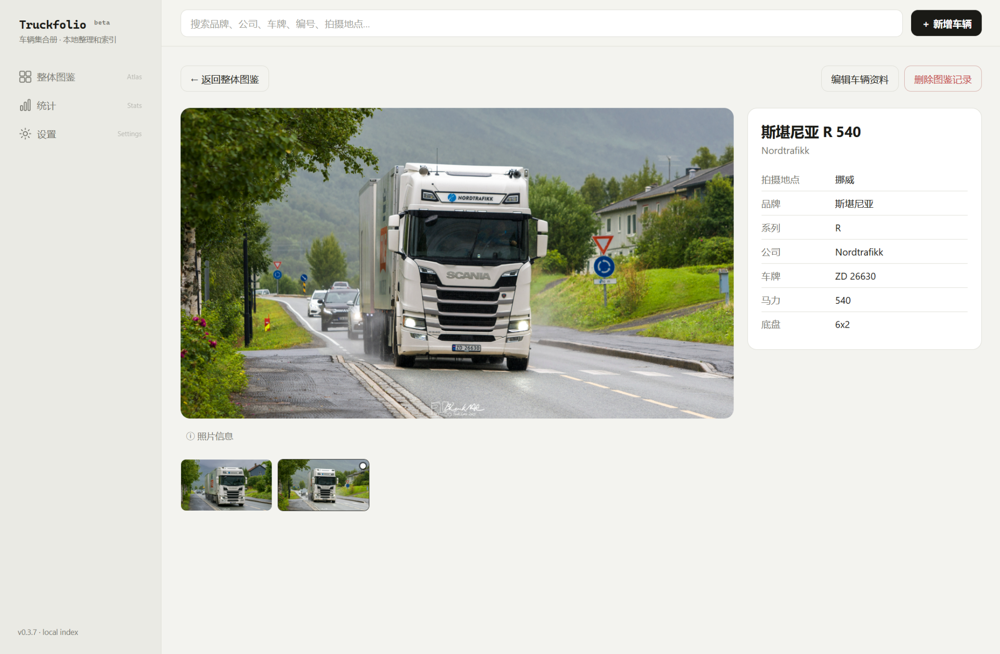
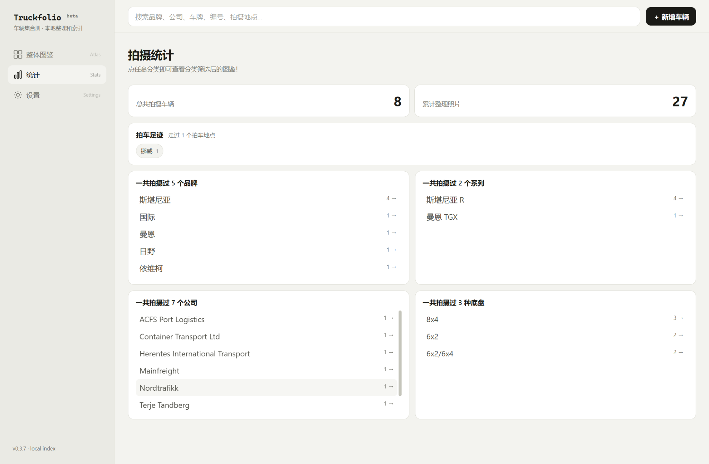
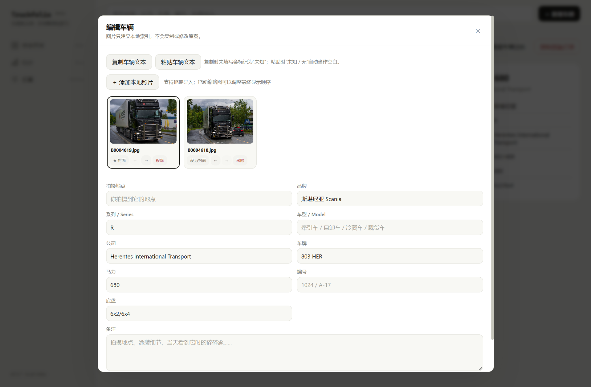

# Truckfolio beta

**为卡车摄影爱好者制作。**

Truckfolio 是一款用于整理 **卡车摄影作品** 的本地图鉴工具。  
名字来自 **Truck + Portfolio**。

它最初为个人拍车摄影整理需求而制作，后来因为用着还挺顺手，于是顺便公开发布给有类似需求的人。

> 当前版本：**v0.4.0 Beta**  
> 当前软件界面支持 **中文 / English**。  
> Beta 阶段仍可能偶尔有一些小虫子乱爬 🐛



## 特点

### 📷 为卡车摄影而做

Truckfolio 的信息结构围绕卡车摄影设计，可以为每辆车记录：

- 拍摄地点
- 品牌
- 系列
- 车型
- 公司
- 车牌
- 马力
- 编号
- 底盘
- 备注

同一辆车可以关联多张照片，并设置封面与调整照片顺序。

### 🚛 品牌与车型数据库

Truckfolio 内置卡车品牌与车型数据，并持续扩充：

- 扩展品牌与车型数据库
- 新增 Tatra
- 增加更多 Mercedes-Benz 车型
- 增加 Scania Super 车型变体
- 优化 Scania T 系列说明
- 增加品牌来源信息
- 优化品牌自动识别，精确匹配优先于部分匹配
- 修复 MAN 可能被 Shacman 文本误识别的问题
- 优化 MAN、DAF、JAC、UD 等短品牌名的匹配
- 手动选择品牌后会确认当前选择，避免被自动识别覆盖；再次编辑品牌字段后恢复自动识别

### 🗂 本地图鉴

Truckfolio 使用本地索引管理摄影作品。

添加照片时，软件只记录原始文件的位置：

- 不复制原图
- 不移动原图
- 不修改原图

照片仍然留在原来的文件夹中。



### 🔎 搜索与筛选

可以快速搜索：

- 品牌
- 公司
- 车牌
- 编号
- 拍摄地点

整体图鉴还支持按照：

- 品牌
- 系列
- 底盘

进行组合筛选，并可以调整卡片大小和排序方式。

### 📊 拍摄统计

Truckfolio 会根据已经整理的车辆生成本地摄影统计，包括：

- 已记录车辆数量
- 已整理照片数量
- 拍车足迹
- 拍摄过的品牌
- 拍摄过的系列
- 拍摄过的公司
- 拍摄过的底盘类型

统计项目可以直接进入对应的图鉴结果。



### 🖼 多图管理

每辆车可以保存多张摄影作品，并支持：

- 添加本地照片
- 设置封面
- 拖动调整顺序
- 查看照片信息
- 删除单张关联照片



### 🔍 照片查看器

照片查看器已升级，支持更自然的浏览与缩放：

- 鼠标滚轮缩放
- 图片拖动与平移
- 双击缩放
- 缩放控制按钮
- 更平滑的边界行为
- macOS 触控板双指平移
- macOS 触控板捏合缩放

### 🧰 其他功能

- 大图 / 中图 / 小图三种图鉴密度
- 批量选择车辆
- 重复照片检测
- 原图缺失检查与重新索引
- 本地缓存与存储目录管理
- 浅色 / 深色 / 跟随系统主题
- 中英文品牌名称显示切换
- 中文 / English 界面切换
- 车辆信息文本复制与粘贴

---

## 下载

请前往 GitHub **Releases** 下载最新版本。

| 平台 | 安装包 |
| --- | --- |
| macOS | `.dmg` |
| Windows | `.msi` / `.exe` |

### 系统提示

目前发布的安装包 **没有进行代码签名**。

因此，macOS 或 Windows 在首次安装 / 打开 Truckfolio 时，可能会显示“无法验证开发者”“未知发布者”或类似的安全提示。

请仅从本项目的官方 GitHub Releases 页面下载安装包。

#### macOS

如果 macOS 阻止打开 Truckfolio，可以在尝试启动应用后进入：

**系统设置 → 隐私与安全性 → 仍要打开**

然后再次确认启动。

如果 macOS 直接提示 **“Truckfolio 已损坏，无法打开”** 或要求将应用移到废纸篓，请确认应用是从本项目官方 **GitHub Releases** 下载的，然后将 Truckfolio 拖入 **应用程序（Applications）** 文件夹。

打开 **终端 Terminal**，运行：

```bash
xattr -dr com.apple.quarantine /Applications/Truckfolio.app
```

运行完成后重新打开 Truckfolio。

如果 Truckfolio 不在“应用程序”文件夹中，也可以先在终端输入：

```bash
xattr -dr com.apple.quarantine 
```

保留命令末尾的空格，然后把 `Truckfolio.app` 直接拖进终端窗口，按下 Enter 即可。

#### Windows

Windows SmartScreen 可能会对尚未建立信誉的应用显示提示。请确认安装包来自本项目的 GitHub Releases 页面后，再决定是否继续运行。

---

## 关于 Beta

Truckfolio 目前仍处于 **Beta** 阶段。

主要功能已经可以正常使用，但仍可能存在：

- 偶发 Bug
- 特定环境下的兼容性问题
- 尚未发现的界面或数据异常

如果遇到奇怪的小虫子，欢迎通过 GitHub Issues 提交问题。

---

## 数据与隐私

Truckfolio 是一个本地应用。

车辆资料、照片索引以及应用数据均保存在本地。Truckfolio 不需要上传摄影作品来建立图鉴。

删除 Truckfolio 中的图鉴记录，也不会删除对应的原始照片文件。

---

## 关于名字

**Truckfolio = Truck + Portfolio**

一个专门拿来装卡车摄影作品的小图鉴。

---

## Credits

**Design — x64**  
**Development — GaGateway**

---

## License

Truckfolio 当前不是开源软件。

Copyright © 2026 GaGateway. All rights reserved.

未经许可，不得复制、修改、重新发布或分发 Truckfolio 的源代码。

---

# English

## Truckfolio beta

**Built for truck photography enthusiasts.**

Truckfolio is a local catalog application designed for organizing **truck photography**.

The name comes from **Truck + Portfolio**.

Originally created for personal truck-photography organization, Truckfolio eventually became useful enough to be released publicly for others with similar needs.

> Current version: **v0.4.0 Beta**  
> The application interface is available in **Chinese and English**.  
> As a Beta release, a few little bugs may still be crawling around. 🐛

## Features

### 📷 Designed around truck photography

Truckfolio provides dedicated fields for recording:

- Shooting location
- Brand
- Series
- Model
- Company
- License plate
- Horsepower
- Fleet number
- Chassis configuration
- Notes

Multiple photos can be associated with the same truck, with support for choosing a cover image and rearranging photo order.

### 🚛 Brand and model database

Truckfolio includes a built-in truck brand and model database that continues to expand:

- Expanded truck brand and model coverage
- Added Tatra
- Added more Mercedes-Benz models
- Added Scania Super variants
- Improved Scania T-series description
- Added brand origin information
- Improved automatic brand recognition with exact matches taking priority over partial matches
- Fixed MAN being incorrectly detected inside Shacman
- Improved matching for short brand names such as MAN, DAF, JAC, and UD
- Manual brand selection now confirms the current choice and prevents automatic recognition from overriding it; editing the brand field again re-enables automatic recognition

### 🗂 Local photo catalog

Truckfolio works as a local index for your photography collection.

When photos are added, Truckfolio only records the location of the original files.

It does **not**:

- Copy the original photos
- Move the original photos
- Modify the original photos

Your images stay exactly where they already are.

### 🔎 Search and filtering

Truckfolio can search across:

- Brand
- Company
- License plate
- Fleet number
- Shooting location

The main catalog also supports combined filtering by:

- Brand
- Series
- Chassis configuration

Card size and sorting options can also be adjusted.

### 📊 Photography statistics

Truckfolio automatically generates local statistics from your catalog, including:

- Number of recorded trucks
- Number of indexed photos
- Photography locations
- Brands photographed
- Series photographed
- Companies photographed
- Chassis configurations photographed

Statistics can also be used to jump directly into matching catalog results.

### 🖼 Multi-photo management

Each truck entry can contain multiple photographs, with support for:

- Adding local photos
- Choosing a cover image
- Drag-and-drop ordering
- Viewing photo information
- Removing individual photo associations

### 🔍 Photo viewer

The photo viewer has been upgraded for smoother browsing and zooming:

- Mouse wheel zoom
- Image dragging and panning
- Double-click zoom
- Zoom controls
- Smoother boundary behavior
- macOS trackpad two-finger panning
- macOS trackpad pinch-to-zoom

### 🧰 Additional features

- Large / Medium / Small catalog card sizes
- Batch vehicle selection
- Duplicate-photo detection
- Missing-file detection and re-indexing
- Local cache and storage-directory management
- Light / Dark / System theme
- Chinese / English brand-name display
- Chinese / English interface language switching
- Copying and pasting structured vehicle information

---

## Download

Download the latest version from **GitHub Releases**.

| Platform | Package |
| --- | --- |
| macOS | `.dmg` |
| Windows | `.msi` / `.exe` |

### Installation notice

Current Truckfolio builds are **not code-signed**.

Because of this, macOS or Windows may display an unidentified developer, unknown publisher, or similar security warning when Truckfolio is installed or opened for the first time.

Only download Truckfolio from the official GitHub Releases page of this project.

#### macOS

If macOS prevents Truckfolio from opening, try launching it once and then go to:

**System Settings → Privacy & Security → Open Anyway**

Confirm the prompt to launch the application.

If macOS instead says **“Truckfolio is damaged and can’t be opened”** or asks you to move it to the Trash, make sure Truckfolio was downloaded from this project's official **GitHub Releases** page, then move Truckfolio into the **Applications** folder.

Open **Terminal** and run:

```bash
xattr -dr com.apple.quarantine /Applications/Truckfolio.app
```

After the command finishes, try opening Truckfolio again.

If Truckfolio is stored somewhere else, you can type the following command in Terminal:

```bash
xattr -dr com.apple.quarantine 
```

Keep the trailing space, drag `Truckfolio.app` directly into the Terminal window to insert its full path, then press Enter.

#### Windows

Windows SmartScreen may display a warning for an application that has not yet established reputation. Verify that the installer came from this project's GitHub Releases page before deciding whether to continue.

---

## Beta status

Truckfolio is currently in **Beta**.

The main functionality is usable, but the application may still contain:

- Occasional bugs
- Compatibility issues in specific environments
- Undiscovered interface or data-related problems

If you find a strange little bug, feel free to report it through GitHub Issues.

---

## Data & Privacy

Truckfolio is a local application.

Vehicle information, photo indexes, and application data are stored locally. Truckfolio does not require uploading your photography collection in order to build the catalog.

Removing a catalog entry from Truckfolio does not delete the corresponding original photo files.

---

## About the name

**Truckfolio = Truck + Portfolio**

A little catalog made specifically for truck photography.

---

## Credits

**Design — x64**  
**Development — GaGateway**

---

## License

Truckfolio is currently proprietary software and is not open source.

Copyright © 2026 GaGateway. All rights reserved.

The Truckfolio source code may not be copied, modified, republished, or redistributed without permission.
